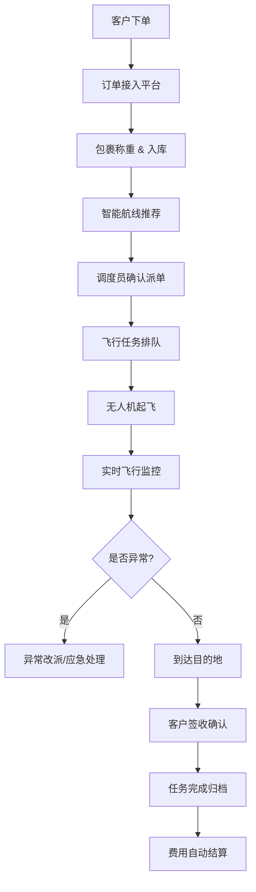

## 1. 产品概述

低空物流配送 Web 平台是面向城市即时配送企业的无人机取送件业务管理系统。平台整合订单接入、航线规划、任务调度、飞行监控、客户服务等全链路功能，助力企业实现低空物流的数字化、智能化运营。

- 核心目标：解决城市即时配送最后三公里效率瓶颈，降低配送成本，提升服务质量
- 目标用户：城市即时配送企业运营管理人员、调度人员、客服人员
- 市场价值：响应低空经济发展趋势，赋能传统物流企业向智能化转型

## 2. 核心功能

### 2.1 用户角色

| 角色 | 登录方式 | 核心权限 |
|------|----------|----------|
| 系统管理员 | 账号密码登录 | 系统配置、用户管理、权限分配 |
| 运营调度员 | 账号密码登录 | 订单管理、任务调度、航线规划、实时监控 |
| 站点管理员 | 账号密码登录 | 站点库存管理、起降点维护、包裹处理 |
| 客服专员 | 账号密码登录 | 客户服务、投诉处理、赔付登记 |
| 财务人员 | 账号密码登录 | 费用结算、报表统计、账单管理 |

### 2.2 功能模块

1. **运营看板**：实时数据概览、飞行态势监控、关键指标展示
2. **订单列表**：订单接入、订单查询、批量操作、状态跟踪
3. **航线地图**：航线规划、禁飞区显示、实时飞行轨迹、天气图层
4. **站点管理**：站点信息、起降点管理、库存监控、设备管理
5. **任务详情**：飞行任务、包裹信息、进度追踪、异常处理
6. **客户服务**：客户信息、服务评价、投诉处理、赔付登记
7. **结算报表**：费用统计、账单生成、数据报表、财务分析

### 2.3 页面详情

| 页面名称 | 模块名称 | 功能描述 |
|-----------|-------------|---------------------|
| 运营看板 | 数据概览 | 今日订单量、配送完成率、在飞无人机数量、异常告警统计 |
| 运营看板 | 实时态势 | 地图展示所有无人机实时位置、飞行状态、任务进度 |
| 运营看板 | 关键指标 | 配送时效、准点率、客户满意度、成本分析趋势图 |
| 订单列表 | 订单管理 | 订单列表展示、筛选搜索、批量派单、订单详情查看 |
| 订单列表 | 订单接入 | 手动创建订单、批量导入、API 接入第三方订单 |
| 订单列表 | 包裹称重 | 包裹信息录入、重量校验、标签打印 |
| 航线地图 | 航线规划 | 起终点选择、智能航线推荐、禁飞区绕行、高度规划 |
| 航线地图 | 实时监控 | 无人机实时位置、飞行轨迹回放、视频流接入（可选） |
| 航线地图 | 天气图层 | 实时天气、风速风向、降雨预警、天气暂停机制 |
| 站点管理 | 站点信息 | 站点列表、位置管理、库容配置、运营班次设置 |
| 站点管理 | 起降点管理 | 起降点位置、状态监控、占用情况、维护记录 |
| 站点管理 | 库存管理 | 包裹入库、出库、库存盘点、超时预警 |
| 任务详情 | 任务队列 | 待执行任务、执行中任务、已完成任务、任务优先级调整 |
| 任务详情 | 进度追踪 | 任务节点、时间线、位置更新、预计到达时间 |
| 任务详情 | 异常处理 | 电量评估、异常告警、改派调度、应急降落 |
| 客户服务 | 客户管理 | 客户信息、寄收件历史、联系方式管理 |
| 客户服务 | 通知管理 | 短信/APP 推送、配送状态通知、签收确认 |
| 客户服务 | 评价赔付 | 服务评价查看、投诉处理、赔付登记与审核 |
| 结算报表 | 费用结算 | 配送费用计算、账单生成、对账管理 |
| 结算报表 | 统计报表 | 日/周/月报表、业务趋势分析、成本效益分析 |
| 结算报表 | 数据导出 | 报表导出、自定义数据查询 |

## 3. 核心流程

### 3.1 订单配送主流程

客户下单 → 订单接入 → 包裹称重入库 → 航线规划推荐 → 批量派单 → 任务排队 → 无人机起飞 → 配送中监控 → 到达目的地 → 客户签收 → 任务完成 → 费用结算

### 3.2 异常处理流程

飞行中异常 → 系统告警 → 调度员介入 → 评估异常类型 → 应急降落/就近返航 → 任务改派 → 客户通知 → 赔付登记

## 4. 用户界面设计

### 4.1 设计风格

- **主色调**：深空蓝 (#0F172A) 作为主背景，科技蓝 (#3B82F6) 作为主色调
- **辅助色**：翡翠绿 (#10B981) 表示成功/正常，琥珀橙 (#F59E0B) 表示警告，玫瑰红 (#F43F5E) 表示异常/危险
- **中性色**： slate 色系渐变，保证信息层级清晰
- **按钮风格**：圆角 6px，轻微悬浮效果，状态色区分明显
- **字体**：主字体使用 JetBrains Mono 搭配 Inter，等宽字体展示数据增强科技感
- **布局风格**：侧边导航 + 顶部状态栏 + 内容区域的经典控制台布局，卡片式信息展示
- **图标风格**：Lucide 线性图标，统一 24px 尺寸，配色与主题保持一致

### 4.2 设计理念

采用科技工业风（Tech Industrial）设计语言，深色主题为主，突出数据可视化和地图组件。界面强调信息密度与可读性的平衡，通过微妙的渐变、发光效果和网格纹理营造未来科技感。

### 4.2 页面设计概述

| 页面名称 | 模块名称 | UI 元素 |
|-----------|-------------|-------------|
| 运营看板 | 数据概览 | 大数字卡片、趋势迷你图、状态指示灯、动画计数效果 |
| 运营看板 | 实时态势 | 全屏地图、无人机图标、飞行轨迹线、动态发光效果 |
| 订单列表 | 订单管理 | 数据表格、筛选侧边栏、批量操作栏、行悬停高亮 |
| 航线地图 | 航线规划 | 交互式地图、起终点标记、航线路径、距离/时间计算面板 |
| 站点管理 | 站点信息 | 卡片网格布局、站点状态标签、库存进度条 |
| 任务详情 | 进度追踪 | 时间线组件、状态徽章、位置地图、实时数据刷新 |
| 结算报表 | 统计图表 | ECharts 柱状图/折线图/饼图、数据钻取、渐变填充 |

### 4.3 响应式

- 桌面端优先设计（1920×1080 为基准）
- 适配 1366×768 及以上分辨率
- 侧边栏可折叠，适应小屏设备
- 表格支持横向滚动，保证数据完整性

### 4.4 动效设计

- 页面加载：元素淡入 + 轻微上移动画，stagger 延迟效果
- 数据更新：数字变化使用平滑过渡动画
- 地图元素：无人机呼吸灯效果、航线段落动画
- 交互反馈：按钮 hover 状态、卡片 elevation 变化、模态框淡入淡出
