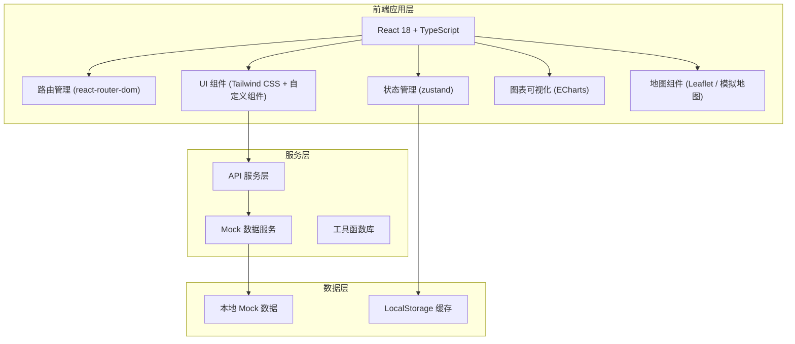

## 1. 架构设计



## 2. 技术描述

- **前端框架**：React@18 + TypeScript
- **构建工具**：Vite@5
- **路由管理**：react-router-dom@6
- **状态管理**：zustand@4
- **样式方案**：Tailwind CSS@3
- **图标库**：lucide-react
- **图表库**：echarts@5 + echarts-for-react
- **地图组件**：使用 Leaflet 或自定义 SVG 地图（模拟实现）
- **后端**：无后端，使用纯前端 Mock 数据模拟
- **数据方案**：前端 Mock 数据 + LocalStorage 持久化

## 3. 路由定义

| 路由路径 | 页面名称 | 说明 |
|-------|---------|------|
| / | 运营看板 | 首页，数据概览与实时态势 |
| /orders | 订单列表 | 订单管理与查询 |
| /orders/:id | 订单详情 | 单个订单的详细信息 |
| /routes | 航线地图 | 航线规划与飞行监控 |
| /stations | 站点管理 | 站点与起降点管理 |
| /tasks | 任务中心 | 飞行任务队列与详情 |
| /tasks/:id | 任务详情 | 单个任务的详细追踪 |
| /customer | 客户服务 | 客户管理与服务评价 |
| /settlement | 结算报表 | 费用结算与数据统计 |

## 4. 核心数据模型

### 4.1 数据类型定义

```typescript
// 订单状态
type OrderStatus = 'pending' | 'weighted' | 'dispatched' | 'flying' | 'delivered' | 'signed' | 'exception' | 'cancelled';

// 任务状态
type TaskStatus = 'queued' | 'ready' | 'flying' | 'landing' | 'completed' | 'exception';

// 无人机状态
type DroneStatus = 'idle' | 'charging' | 'flying' | 'landing' | 'maintenance' | 'offline';

// 站点类型
interface Station {
  id: string;
  name: string;
  address: string;
  lat: number;
  lng: number;
  capacity: number;
  currentStock: number;
  landingPads: number;
  availablePads: number;
  status: 'active' | 'maintenance' | 'offline';
  operatingHours: string;
}

// 起降点
interface LandingPad {
  id: string;
  stationId: string;
  name: string;
  status: 'available' | 'occupied' | 'maintenance';
  currentDrone?: string;
}

// 订单
interface Order {
  id: string;
  orderNo: string;
  sender: {
    name: string;
    phone: string;
    address: string;
    lat: number;
    lng: number;
  };
  receiver: {
    name: string;
    phone: string;
    address: string;
    lat: number;
    lng: number;
  };
  package: {
    weight: number;
    size: 'small' | 'medium' | 'large';
    description: string;
  };
  status: OrderStatus;
  createTime: string;
  weightTime?: string;
  dispatchTime?: string;
  deliverTime?: string;
  signTime?: string;
  taskId?: string;
  amount: number;
  remark?: string;
}

// 飞行任务
interface FlightTask {
  id: string;
  taskNo: string;
  orderId: string;
  droneId: string;
  route: Route;
  status: TaskStatus;
  estimatedDuration: number;
  actualDuration?: number;
  estimatedArrival: string;
  createTime: string;
  startTime?: string;
  endTime?: string;
  currentBattery: number;
  currentLat: number;
  currentLng: number;
  progress: number;
}

// 航线
interface Route {
  id: string;
  startPoint: { lat: number; lng: number; name: string };
  endPoint: { lat: number; lng: number; name: string };
  waypoints: { lat: number; lng: number }[];
  distance: number;
  estimatedTime: number;
  avoidZones: string[];
}

// 无人机
interface Drone {
  id: string;
  name: string;
  model: string;
  status: DroneStatus;
  battery: number;
  maxLoad: number;
  currentLoad: number;
  currentStationId?: string;
  currentTaskId?: string;
  totalFlights: number;
  totalDistance: number;
  lastMaintenance: string;
}

// 客户评价
interface Review {
  id: string;
  orderId: string;
  customerName: string;
  rating: number;
  comment: string;
  createTime: string;
}

// 赔付记录
interface Compensation {
  id: string;
  orderId: string;
  amount: number;
  reason: string;
  status: 'pending' | 'approved' | 'rejected';
  createTime: string;
  handler: string;
}
```

## 5. 项目目录结构

```
src/
├── components/          # 公共组件
│   ├── Layout/         # 布局组件
│   ├── Sidebar/        # 侧边导航
│   ├── Header/         # 顶部状态栏
│   ├── DataCard/       # 数据卡片
│   ├── StatusBadge/    # 状态徽章
│   ├── Table/          # 数据表格
│   ├── Modal/          # 模态框
│   ├── Map/            # 地图组件
│   ├── Timeline/       # 时间线
│   └── Chart/          # 图表组件
├── pages/              # 页面组件
│   ├── Dashboard/      # 运营看板
│   ├── Orders/         # 订单列表
│   ├── OrderDetail/    # 订单详情
│   ├── Routes/         # 航线地图
│   ├── Stations/       # 站点管理
│   ├── Tasks/          # 任务中心
│   ├── TaskDetail/     # 任务详情
│   ├── Customer/       # 客户服务
│   └── Settlement/     # 结算报表
├── store/              # 状态管理
│   ├── useOrderStore.ts
│   ├── useTaskStore.ts
│   ├── useDroneStore.ts
│   └── useStationStore.ts
├── mock/               # Mock 数据
│   ├── orders.ts
│   ├── tasks.ts
│   ├── drones.ts
│   ├── stations.ts
│   └── index.ts
├── types/              # TypeScript 类型定义
│   └── index.ts
├── utils/              # 工具函数
│   ├── format.ts
│   ├── map.ts
│   └── date.ts
├── App.tsx
├── main.tsx
└── index.css
```

## 6. 核心功能实现策略

### 6.1 地图实现
- 使用 SVG 自定义城市地图模拟，或集成 Leaflet
- 实现无人机位置实时更新动画
- 绘制航线、禁飞区、起降点等图层

### 6.2 数据模拟
- 生成真实感的 Mock 数据（50+ 订单、20+ 无人机、10+ 站点）
- 使用定时器模拟实时数据更新（无人机位置、任务进度等）
- 实现状态流转的自动模拟

### 6.3 交互实现
- 所有页面间路由跳转正常
- 关键操作（派单、改派、签收等）有完整交互反馈
- 表单验证与数据提交模拟
- 表格筛选、排序、分页功能

### 6.4 视觉动效
- 页面切换过渡动画
- 数据加载骨架屏
- 无人机位置移动动画
- 图表数据渐变动画
- 状态变化微交互
